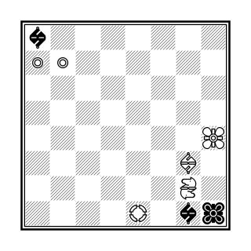
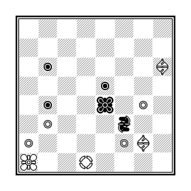
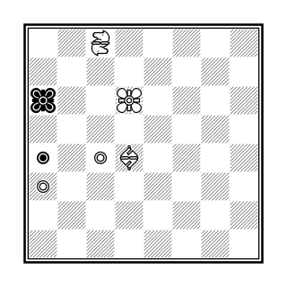
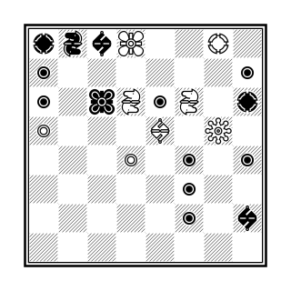
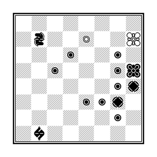
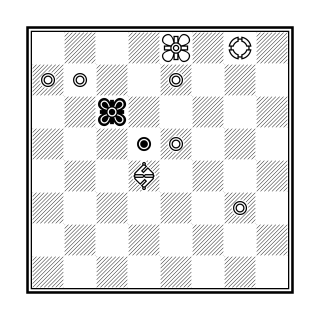
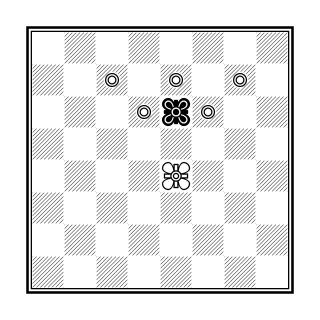

# Mater

## Overview

*Mater* is a mate searching program written in Pascal by Valentin Albillo.

In this repository you can find the original program by V. Albillo, and a version retouched by me (Roland Chastain).

You can find the original program [here](original/mater.txt). The compressed file *website.zip* contains the documentation of the original program.

## Examples

Here are eight problems coming from *Mater* original website. These problems are solved in the program *demo.pas*.

### Position 1

    b7/PP6/8/8/7K/6B1/6N1/4R1bk w KQkq -

    Search mode: all moves
    Maximum moves number: 3
    Result: b7a8n
    Time elapsed: 00:00:00:010

### Position 2

    8/8/1p5B/4p3/1p2k1P1/1P3n2/P4PB1/K2R4 w KQkq -

    Search mode: all moves
    Maximum moves number: 3
    Result: h6c1
    Time elapsed: 00:00:00:004

### Position 3

    2N5/8/k2K4/8/p1PB4/P7/8/8 w KQkq -

    Search mode: all moves
    Maximum moves number: 4
    Result: d6c7
    Time elapsed: 00:00:00:053

### Position 4

    rnbK2R1/p6p/p1kNpN1r/P3B1Q1/3P1p1p/5p2/5p1b/8 w KQkq -

    Search mode: all moves
    Maximum moves number: 4
    Result: f6d5
    Time elapsed: 00:00:01:395

### Position 5

    8/1n2P2K/3p2p1/2p3pk/6pr/4ppr1/6p1/1b6 w KQkq -

    Search mode: all moves
    Maximum moves number: 3
    Result: h7g7
    Time elapsed: 00:00:00:005

### Position 6

    4K1R1/PP2P3/2k5/3pP3/3B4/6P1/8/8 w KQkq -

    Search mode: all moves
    Maximum moves number: 3
    Result: b7b8r
    Time elapsed: 00:00:00:012

### Position 7

    8/2P1P1P1/3PkP2/8/4K3/8/8/8 w Qkq -

    Search mode: all moves
    Maximum moves number: 3
    Result: e7e8b
    Time elapsed: 00:00:00:008

### Position 8

    3nn3/2p2p1k/1p1pp1p1/p2B3p/r2B2N1/7N/8/7K w KQkq -

    Search mode: check sequence
    Maximum moves number: 12
    Result: h3g5
    Time elapsed: 00:00:00:036

As you can see, *Mater* has two search modes: either he searches for all moves, or he only searches for checkmate by consecutive checks (as in the last example).

## Usage

*Mater* expects at less two parameters: the position (in the EPD format) and the moves number. A third parameter can be used to change the search mode, so that only mates by consecutive checks are searched.

    mater -position '3nn3/2p2p1k/1p1pp1p1/p2B3p/r2B2N1/7N/8/7K w KQkq -' -moves 12 -check
    mater -p '3nn3/2p2p1k/1p1pp1p1/p2B3p/r2B2N1/7N/8/7K w KQkq -' -m 12 -c
